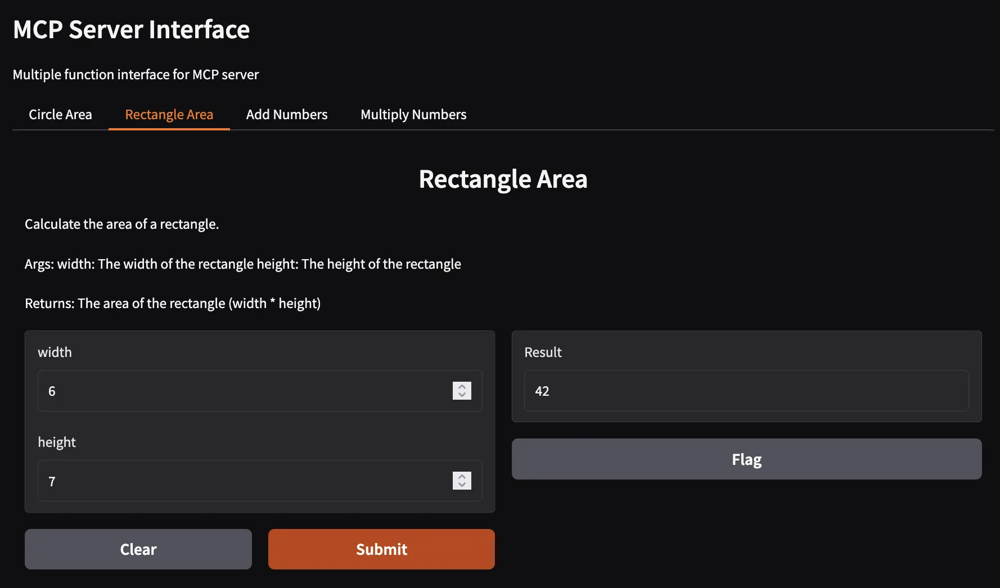
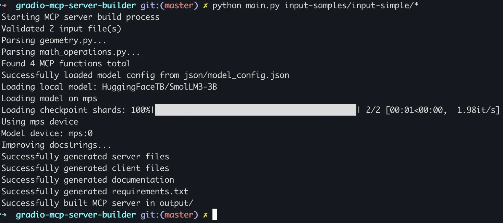
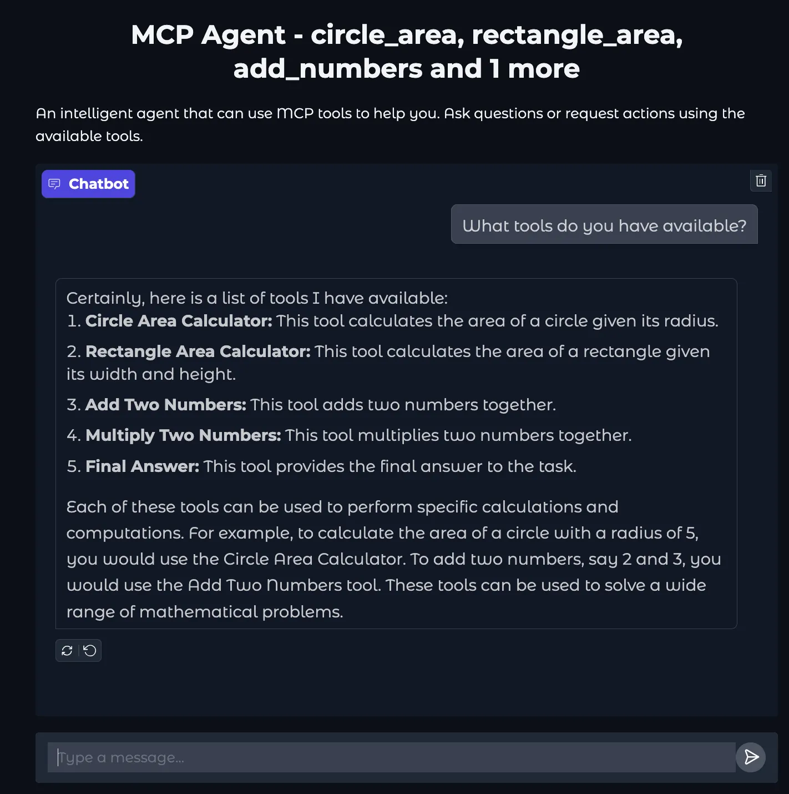
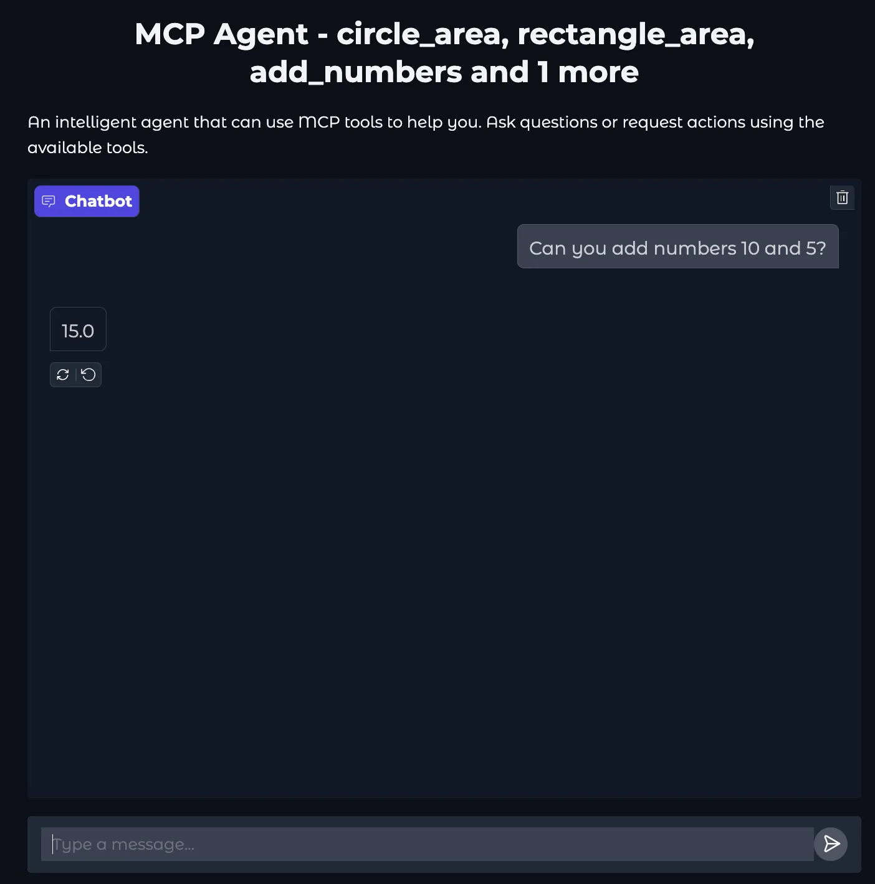
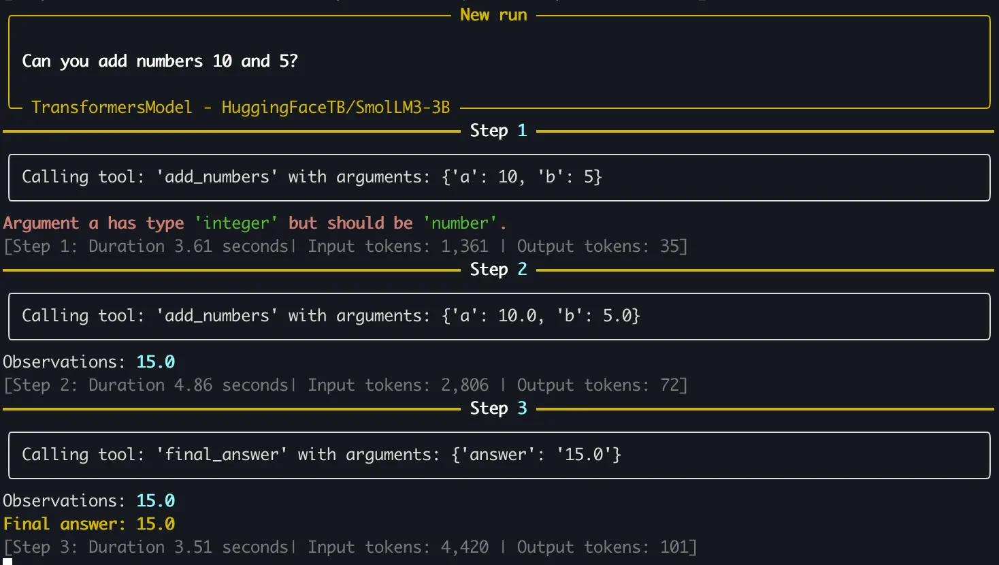

# Gradio MCP Server Builder

> **Turn your Python functions into web services in minutes**

[](https://www.python.org/downloads/)
[](https://creativecommons.org/licenses/by-nc/4.0/)
[](https://github.com/juliensimon/gradio-mcp-server-builder/actions/workflows/ci.yml)
[](https://github.com/psf/black)
[](https://pycqa.github.io/isort/)

## What It Does

Transform your Python functions into MCP (Model Context Protocol) servers with practical web interfaces. No web development skills required.

**From this:**
```python
@mcp.tool()
def circle_area(radius: float) -> float:
    """Calculate the area of a circle."""
    return math.pi * radius * radius

@mcp.tool()
def rectangle_area(width: float, height: float) -> float:
    """Calculate the area of a rectangle."""
    return width * height

@mcp.tool()
def add_numbers(a: float, b: float) -> float:
    """Add two numbers together."""
    return a + b

@mcp.tool()
def multiply_numbers(a: float, b: float) -> float:
    """Multiply two numbers."""
    return a * b
```

**To this:**


## Quick Start

1. **Install:**
```bash
git clone https://github.com/juliensimon/gradio-mcp-server-builder.git
cd gradio-mcp-server-builder
pip install -r requirements.txt
```

2. **Create your functions:**
```python
@mcp.tool()
def greet_user(name: str) -> str:
    """Generate a friendly greeting message."""
    return f"Hello, {name}! Welcome to your first MCP server!"

@mcp.tool()
def add_numbers(a: float, b: float) -> float:
    """Add two numbers together."""
    return a + b
```

3. **Generate and run:**
```bash
python main.py my_functions.py --preserve-docstrings
cd output && python server/gradio_server.py
```

4. **Open your browser:** <http://127.0.0.1:7860>

**That's it!** Your functions are now a web service with a functional interface.

## Visual Demo

See the complete workflow:


*Building an MCP server from Python functions*


*The generated Gradio server interface*


*MCP client interface showing available tools*


*Using the client to call a function*


*Terminal output showing the function execution*

## What You Get

The builder generates everything you need:

- **🚀 MCP Server** - Exposes your functions as callable tools
- **🌐 Gradio Interface** - Practical web UI for testing and demonstration
- **📚 AI-generated docstrings** - Enhanced function documentation
- **🧪 Test Client** - For testing the server
- **⚙️ Configuration** - Requirements and config files


## How It Works

The tool automatically:

1. **Parses** your `@mcp.tool()` decorated functions
2. **Generates** an MCP server with validation and error handling
3. **Creates** a responsive Gradio UI based on your function signatures
4. **Enhances** function docstrings with AI


## Configuration

### Basic Options
```bash
# Preserve original docstrings (don't enhance with AI)
python main.py functions.py --preserve-docstrings

# Specify output directory
python main.py functions.py --output-dir my_server

# Enable Gradio sharing (creates public URL)
python main.py functions.py --share
```

### Model Configuration
```bash
# Use a local Hugging Face model
python main.py functions.py --local-model "microsoft/DialoGPT-medium"

# Use an OpenAI-compatible endpoint
python main.py functions.py --model-endpoint http://localhost:8000
```

## Examples

Check the `input-samples/` directory for complete examples:

- `input-simple/` - Basic math and geometry functions
- `input-hello-world/` - Minimal example
- `input-advanced/` - Complex data processing tasks

## Documentation

- **[Quick Start Guide](docs/getting-started/quickstart.md)** - Step-by-step tutorial
- **[User Guide](docs/user-guide/input-format.md)** - Function format requirements
- **[Configuration Guide](docs/configuration/overview.md)** - Advanced configuration

### Local Documentation
```bash
./serve-docs.sh
```
Then visit <http://127.0.0.1:8001>

## Development

### Setup
```bash
# Quick setup
./setup-dev.sh

# Or manual setup
pip install -r requirements-dev.txt
pre-commit install
```

### Testing
```bash
# Fast tests (CI)
python -m pytest tests/ -v --ignore=tests/slow/

# Slow tests (local development)
./run-slow-tests.sh
```

The project uses pre-commit hooks for automatic code formatting and linting. See [tests/slow/README.md](tests/slow/README.md) for detailed testing information.

## Contributing

We welcome contributions! Please check existing issues before submitting changes.

**Before submitting a pull request:**
1. Set up the development environment
2. Ensure all pre-commit hooks pass
3. Add tests for new functionality
4. Update documentation as needed

## License

This project is licensed under CC BY-NC 4.0. You're free to use it for personal and educational projects, but commercial use requires permission.

---

**Ready to get started?** Check out the [Quick Start Guide](docs/getting-started/quickstart.md) for a detailed walkthrough.
